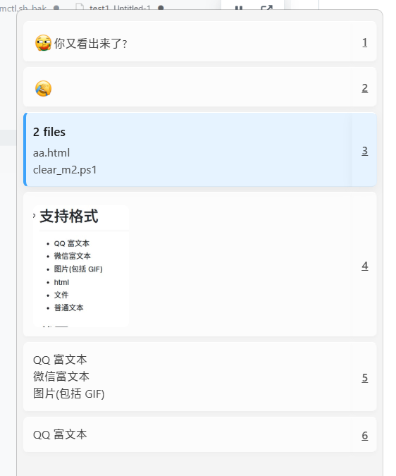

# ClipOne

<p align="center">
  
</p>

<p align="center">
  <b>极简、轻量、纯原生的 Windows 剪贴板增强神器</b><br>
  <sub>基于 .NET 10 Native AOT 极限裁剪 + Photino.NET 零依赖架构打造</sub>
</p>

<p align="center">
  <a href="LICENSE"></a>
  </a>
  
  
</p>

---

## 🌟 核心特性

- ⚡ **Native AOT 极限裁剪**：采用 .NET 10 Native AOT 静态编译与全量剪裁，彻底剥离 CLR 虚拟机与 JIT 引擎，单文件仅 **~8.0 MB**，启动速度达到毫秒级。
- 🚫 **零运行时依赖**：解压即用，无需在系统上预先安装任何版本的 .NET Runtime 或 .NET Framework。
- ☁️ **多端无冲突云盘同步 (Cloud Sync)**：
  - **设备隔离追加写入 (Device-Partitioned Append-Only)**：每台电脑仅写入本机的日志分片，从根源上杜绝多设备写争抢与网盘“冲突副本”；
  - **绿色便携零配置**：直接将 ClipOne 文件夹扔进网盘（OneDrive、坚果云、iCloud、Syncthing、Google Drive 等），多台电脑打开即自动实时互通；亦可在配置中指定自定义同步路径；
  - **墓碑软删除机制 (Tombstone)**：在一端删除某项，其他设备自动同步移除，彻底解决多端旧数据“复活”问题。
- 💫 **满帧 GPU 硬件加速与弹性阻尼回弹**：
  - 彻底摒弃老旧 JS 虚拟滚动，回归 Chromium 原生 GPU Compositor 硬件加速，支持 120Hz/144Hz 高刷与高精度触控板平滑惯性滚动；
  - **顶/底弹性阻尼回弹 (Rubber-band Bounce)**：滚动触达顶端或底端时带来类似 macOS/iOS 的丝滑弹性阻尼回弹效果。
- 🎨 **轻量 Web 渲染与实时换肤**：基于 Photino.NET + WebView2 渲染界面，彻底摒弃臃肿的 WPF/XAML 框架；支持 **浅色 / 深色 / 跟随系统** 及多种内置皮肤（Fluent 质感置顶），**0 毫秒即点即换**。
- 📋 **原生多格式剪贴板全面支持**：纯 Win32 / WinRT 底层 API 监听与写入，默认全面支持 **QQ 富文本**、**微信富文本**、**图片 (含 GIF)**、**HTML 片段**、**文件列表** 与 **纯文本**。
- 🚀 **零反射源生成序列化**：使用 `System.Text.Json` Source Generator 进行编译期序列化，提供极速的历史记录与配置读写性能。
- 🛠️ **完整开发者工具支持**：托盘一键打开独立的 DevTools 调试窗口，支持网页右键元素检查，调试期间窗口自动常驻前台，关闭 DevTools 自动同步隐藏。

---

## 📖 使用指南

### 1. 唤出与粘贴
- **唤醒界面**：默认通过 `Win + V` 或 `Alt + V`（支持在界面中自定义组合键）在光标处呼出剪贴板历史记录面板。
- **单击条目**：直接将该记录粘贴到当前处于焦点的活动窗口中。
- **鼠标中键**：仅将该记录设置到剪贴板中，不执行自动粘贴动作。
- **鼠标右键**：选择该项但不会改变列表历史排序。
- **隐藏界面**：按 `ESC` 键或点击外部任意区域自动隐藏。

### 2. 批量与连续粘贴
- **范围粘贴**：按住 `Shift` 键点击选择**起始项**与**结束项**（按住期间可多次点击调整，以第 1 次和最后 1 次点击为准），**松开 `Shift` 键**后即可按选择方向连续自动粘贴该区域所有内容（支持从前往后正序粘贴，或从后往前倒序粘贴）。
- **多选粘贴**：按住 `Ctrl` 键依次点选多项，松开或选定后将按点击顺序依次进行批量粘贴。

### 3. 搜索与删除
- **快速检索**：按 `Ctrl + F` 呼出搜索栏，实时过滤历史记录。
- **删除单项**：选中某条记录后，直接按下键盘 `Delete` 键即可删除。

### 4. 键盘快速定位
呼出面板后：
- 按 **空格键** 默认选择并粘贴第 1 项 (即最新复制的内容)；
- 按 **回车键** 默认选择并粘贴第 2 项（即上次复制的内容）；
- 前 35 项可通过每行右侧显示的数字或字母快捷键实现一键直达。

---

## 🎨 皮肤与主题模式

ClipOne 内置了多款精心设计的样式，支持通过托盘菜单随时切换：

- **主题模式**：
  - 跟随系统（根据 Windows 系统深浅色设置自适应）
  - 浅色模式 (Light)
  - 深色模式 (Dark)
- **内置皮肤**：
  - `fluent`：现代 Fluent 亚克力质感设计
  - `classic`：经典简约风格
  - `material`：质感拟物设计
  - `stand`：标准紧凑风格
  - `striped`：斑马线交替明晰风格

> 💡 **自定义皮肤**：所有皮肤均位于 `html/css/` 目录下，您可以直接修改或新增 CSS 文件来自定义属于您的专属主题。

## 🖼️ 效果截图与演示

### Fluent 现代质感预览
<p align="center">
  
</p>

### 操作动图演示
<p align="center">
  
</p>

<p align="center">
  
</p>

---

## 💻 编译与构建

### 运行环境要求
- Windows 10 (1803 / 20H2+) 或 Windows 11 (x64)
- [.NET 10 SDK](https://dotnet.microsoft.com/download)

### 常用命令

```powershell
# 1. 还原与编译
dotnet build

# 2. 调试运行
dotnet run

# 3. 发布 Native AOT 极限裁剪版本
dotnet publish -c Release -r win-x64
```

发布产物位于 `bin\x64\Release\net10.0-windows10.0.26100.0\win-x64\publish\`，包含独立的 `ClipOne.exe`、`Photino.Native.dll`、`WebView2Loader.dll` 与 `html/` 资源。

---

## 📄 开源协议

本项目采用 [MIT License](LICENSE) 授权开源，欢迎自由使用、修改与分发。
